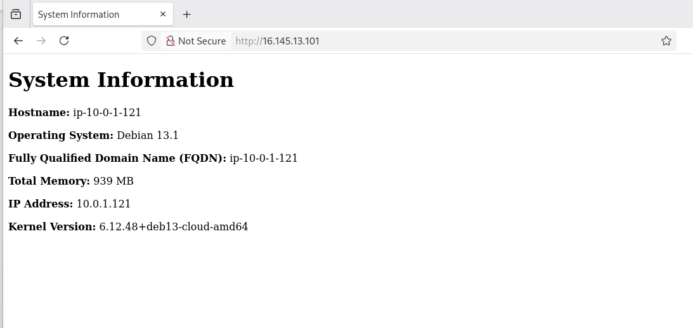

# ACIT4640 Ansible Lab
Roger Hsieh
Kenneth Ng

---

## SSH Key creation & deletion

### Create a new SSH key pair
```bash
ssh-keygen -t ed25519 -f ~/.ssh/aws
```
Generates a new SSH key pair named **aws** and saves it in `~/.ssh/`.  

---

### Import the public key to AWS
```bash
cd scripts
chmod +x import_lab_key
./import_lab_key ~/.ssh/aws.pub
```
Uses **import_lab_key** script to register public key with AWS.  
Terraform will later use this key for SSH accessing the EC2 instances.

---

### Delete the key from AWS (cleanup)
```bash
chmod +x delete_lab_key
./delete_lab_key ~/.ssh/aws.pub
```
At the end of the lab, we run the delete key script which removes the imported key from AWS.

---

## Terraform Commands

Note: All Terraform commands are executed from the **terraform/** directory.

### Initialize Terraform
```bash
cd terraform
terraform init
```
Downloads required provider plugins and sets up the Terraform working directory.

---

### Format Terraform configuration
```bash
terraform fmt
```
Formats Terraform configuration files to standard syntax.

---

### Validate configuration
```bash
terraform validate
```
Performs a syntax and structural check on Terraform configuration files.

---

### Preview infrastructure
```bash
terraform plan
```
Shows which resources will be created or changed without applying them.

---

### Apply configuration
```bash
terraform apply
```
Creates two EC2 instances on AWS and outputs their **public IP addresses** and **DNS names**.

---

## Ansible Commands

Note: All Ansible commands are executed from the **ansible/** directory.

### Update hosts.yml file
```bash
nano ./inventory/hosts.yml
```
Updated `hosts.yml` file with IP address of the two servers.

---

### Update playbook.yml file
```bash
nano playbook.yml
```
Updated `playbook.yml` for the lab requirements. 

---

### Check playbook syntax
```bash
cd ./ansible
ansible-playbook playbook.yml --syntax-check
```
Ensures that YAML syntax and all modules and parameters in `playbook.yml` are correctly defined.

---

### Run the playbook
```bash
ansible-playbook playbook.yml
```
Runs the Ansible playbook to:
- Install Nginx on both servers  
- Copy configuration files  
- Generate the `index.html` file with the given `index.html.j2` template
- Reload and enable the Nginx service  

---

## Cleanup

### Destroy Terraform infrastructure
```bash
cd ./terraform
terraform destroy
```
Removes all EC2 instances and associated resources created by Terraform earlier

---

### Delete AWS key pair from AWS
```bash
cd ../scripts
./delete_lab_key ~/.ssh/aws.pub
```
Removes the AWS key pair imported earlier using the provided script.  

---

## Screenshot


